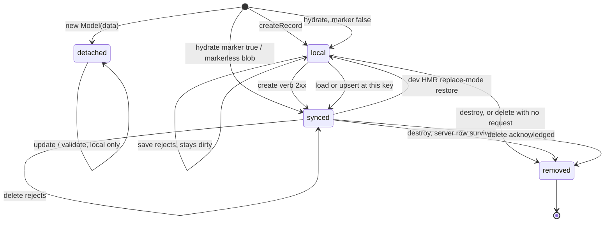

# Store record lifecycle

A record's position in this machine is held by three non-enumerable flags —
`_store`, `_synced`, `_deleted`. They are provenance and identity, never data:
`toJSON()` cannot see them, the merge helpers refuse to copy them off a server
or storage payload, and the persisted wire shape carries provenance out of band
as a `__synced` marker beside the record's own clean JSON. No payload can forge
a position.

## The four positions

**detached** — constructed directly with `new Model(data)` and never handed to a
Store. `update()` and `validate()` still work, because the rules live on the
class, but nothing is indexed and nothing notifies. No public path adopts a
detached record — `createRecord` always builds fresh — so this is a dead end
rather than a waiting room. `save()` and `delete()` reject *asynchronously*,
never as a synchronous throw, so callers only ever `await`.

**local** — indexed by the Store and never round-tripped with a server. `save()`
dispatches the `create` verb. `delete()` removes locally and sends nothing:
there is no server row, so a request could only 404 or strand the record behind
a 4xx the app has already discarded.

**synced** — indexed and carrying server provenance: it arrived from a load, an
`upsert`, storage hydration, or its own successful save. `save()` dispatches
`update`; `delete()` sends the server verb and removes locally on the ack.

**removed** — terminal. `removeRecord` is the only path here, and it is shared
by local `destroy()` and confirmed `delete()`. One terminal state on purpose: a
stale reference cannot tell the two apart and must not have to.

## Entering

`createRecord` is one indivisible step — defaults, primary key, validation,
insert, notify. Validation runs after defaults and pk generation and before the
instance exists, so a failed create inserts nothing, notifies nothing, and
persists nothing. A missing pk auto-generates, except under an explicit
`.primary().required()`: there the required error must surface so a create
form's pre-check blocks submission instead of the Store silently minting a
random key.

Hydration enters at whichever position the persisted marker names, and a
markerless old-format blob enters `synced`. Hydration and server upserts are
validation-exempt by design — startup is fail-soft and the server is
authoritative — so either can seat a record that local rules would have
rejected.

## Invariants

- **`_synced` is provenance, not a clean/dirty bit.** It answers one question:
  does the server have a row for this? It stays true after a save whose response
  was only partly merged, because clearing it would make the queued follow-up
  write POST a duplicate.
- **`_deleted` is read before `_store`.** `removeRecord` nulls `_store`
  unconditionally, so a store-less record is ambiguous — deleted, or never
  added? Flag order is the entire disambiguation: `delete()` reads `_deleted`
  first and resolves idempotently, and only then reads `_store` and rejects with
  the never-added message.
- **`removeRecord` is the only writer of `_deleted`.** That is what lets a write
  queued behind another write test one flag when it reaches the front, with no
  map lookup, and with no chance of false-positiving a first save — which *is*
  indexed under its client-side key before its request goes out.
- **Primary keys are immutable once indexed**, with exactly one sanctioned
  exception: a first save whose response carries a different key. The Store
  performs that re-key itself and atomically, assigning the field directly
  rather than through `update()`, which would throw on a pk change.
- **The index key is not the field.** Number ids are keyed by their string form,
  so a record created from a numeric JSON payload is found by a string route
  param. The field itself keeps the type the server sent.
- **In-flight is not a position.** Concurrent writes on one record serialize
  behind a single per-record chain, and each link reads the record when it
  *reaches the front*, never when it was enqueued. A record awaiting its turn is
  still `local` or `synced`; what a queued write must expect is that the
  position moved while it waited.

## Gotchas

- A removed record still accepts `update()`. The rules are on the class and the
  store notification is an optional call, so the patch validates, lands on an
  object nothing subscribes to, and warns about nothing.
- `delete()` on a never-synced record resolves its `delete` transport *before*
  short-circuiting, so a model with a partial adapter reports the missing verb
  instead of quietly behaving like `destroy()`.
- `destroy()` on a synced record leaves the server row behind. It is a local
  removal, not a delete, and nothing reconciles the difference later.
- Records mutate in place, so identity survives every transition but the last.
  That is why an upsert updates rather than replaces, and why subscribers and
  relationship getters can safely hold references across a load.
- The dev HMR restore is the only way a record moves back from `synced` to
  `local`: replace mode writes the snapshot's provenance onto the live record so
  a locally-created, never-saved record still POSTs after a reload.
