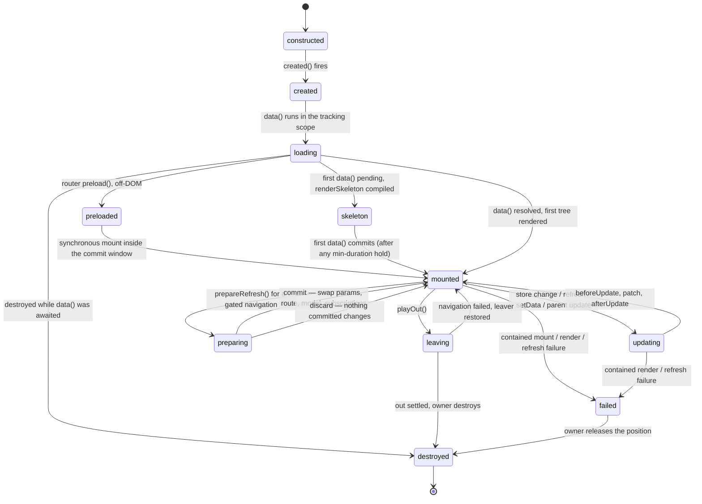

# PuzzleView lifecycle machine

One instance, from construction to teardown. Views, layouts, and reusable
components all run this machine — the only difference is who owns the instance:
the router for a routed view or layout, a parent's patch for a component, the
static kernel for a prerendered page root. Ownership decides the failure
outcome, not the phases.

## Two layers of state, one machine

`data()` owns the model layer and replaces it wholesale on every successful
commit — keys an earlier run returned and this one omits disappear. `setData()`
owns a persistent local layer that wins over the model until the next model
commit, and it schedules a render *without* re-running `data()`. That is why
`updating` is reachable two ways that look identical from the DOM and are not
identical from the instance: one re-ran `data()` and re-derived its
subscriptions, one did not. The full re-render trigger table lives in
[[FLOW-REACTIVITY]].

Subscriptions reset on every `data()` run, so an instance is subscribed to
exactly what its latest run actually queried.

## `preloaded` is what makes the navigation commit atomic

A routed instance runs `created()` and `data()` with no ViewManager at all —
there is nothing to render into, and the render inside the refresh no-ops. The
later mount is therefore synchronous, which is the whole point: the router's
commit window cannot contain an await. A component mounted by a parent patch
takes the ordinary asynchronous path instead and reserves its position with a
comment anchor so sibling insertion references stay valid.

`mounted()` is gated on a real first render, not on the mount call returning. If
a parent prop update supersedes the initial async `data()`, mount completion —
and any pending enter animation — defers to the commit that actually renders,
so the hook never receives the comment anchor.

## `preparing` exists so a failed navigation has nothing to roll back

A reused ancestor is already on screen. During a gated navigation its `data()`
must run against the *destination* — that is how it gates the URL, and how
`this.route` names the navigation being gated — while its committed params,
snapshot, model, DOM and live subscription set stay exactly as they are. The
prepared run's scope is visible only to that evaluation; a store-change refresh
landing in the same window still reads committed state.

The handle is idempotent and is discarded unconditionally on the way out, which
is the only thing that covers a throw escaping the router's synchronous commit
block. An unreleased hold fences the ancestor's keys in the store for the rest
of the session.

## `leaving` is inert, and reversible exactly once

`playOut()` unsubscribes the instance immediately and ignores every later
delivery — refresh, setData, store change, parent update. A fading element must
not re-render. The element stays in the DOM for the whole out animation; the
caller removes it.

The one path back is router recovery: when a navigation fails *after* starting
the leave, the outgoing unit is restored — the retained out effect is
cancelled and a refresh re-establishes the subscription. The out sequence stays
spent, so a later navigation away swaps the unit out instantly with no second
animation.

## `failed` describes a position, not a live instance

Reaching `failed` means `destroy()` has already run on this instance. What
survives is the position: a placeholder planted before teardown, holding either
the app `errorView` — an ordinary compiled view receiving `error`, `info`, and
`retry` — or an invisible recovery marker when no error view is configured.
Parent, siblings, and the surrounding layout keep their state.

Retry never returns *this* instance to `mounted`. It rebuilds through the
position's normal owner: the router forces a same-location replace with the
chain marked non-reusable, or a parent's ordinary refresh remounts a fresh
child. Either way a brand-new instance enters this machine at `constructed`.
The face is held for the whole rebuild and released only by something that
immediately refills the position, so a retry can never leave a blank.

The error view itself failing reports once with `phase: 'error-view'` and
stops — the runtime never mounts an error view for an error view.

## Gotchas

- The `loaded` latch never resets. A skeleton is a first-load affordance, not a
  spinner: later refreshes keep the current content on screen until new data
  commits.
- A `mounted()` throw resolves by owner. A component-owned instance is
  destroyed and its position held for the next parent patch; a router-owned one
  stays committed, because the URL already moved atomically and tearing the view
  down would strand a committed URL over an empty container.
- `destroy()` is synchronous, instant, and idempotent, and a throwing
  `destroyed()` hook is caught — the teardown cascade above it must always
  complete.
- An enter animation with a visible trigger holds the element at its `from`
  keyframe and defers the whole show bracket to the reveal. `mounted()` timing
  is unchanged, and every degradation path lands on plain mount behavior so
  content is never stranded hidden.
