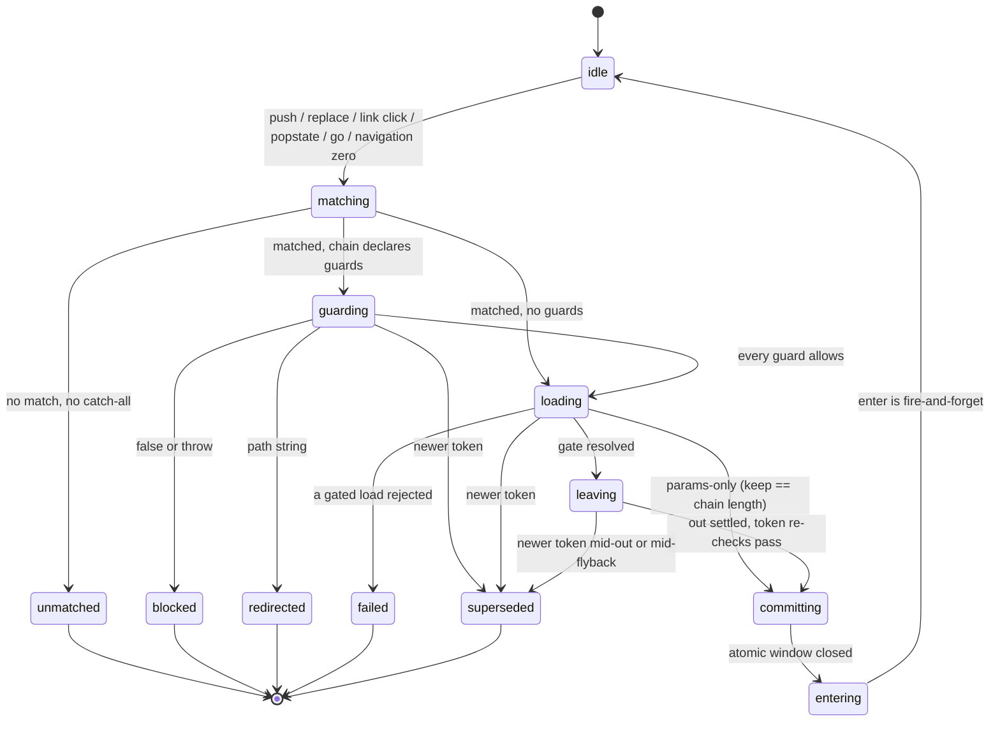

# Navigation state machine

One navigation attempt, from request to commit. The machine is the same in
every router mode — path routing (the inline zero-config default), hash, and
memory — because the mode only owns three seams (reading the URL, writing it,
and the link interceptor), never the phase order. The step-by-step pipeline,
including what each phase actually does, is [[FLOW-NAVIGATION]]; the per-instance
machine the LOAD and COMMIT phases drive is [[STATE-VIEW-LIFECYCLE]].

## The token is the identity of a navigation

A monotonic token is claimed the moment a navigation becomes real — after the
match, never before. That ordering is load-bearing: bumping on an unmatched
path would doom a navigation that is legitimately mid-flight, leaving its
outgoing view fully played out (held invisible by the out animation's fill)
over a router state that still claims it.

Every await in the machine is followed by a token re-check. A resolved value
belonging to a stale token is discarded, not applied. Last navigation wins, and
the loser's obligation is precisely to clean up what it built and leave what it
did not.

## The commit is atomic because a partial commit has no correct repair

`committing` is one synchronous block with no await inside it. It moves
together:

- the URL and history entry (or, in a urlless mode, the entry stack and index)
- `document.title`, resolved nearest-defined leaf to root
- the outgoing entry's scroll position, saved under its own key
- the mounted DOM tree
- the router's committed state — path, query, params, chain, instances, keys
- every prepared reused-ancestor refresh: params, route snapshot, model, and
  store subscriptions
- the incoming scroll landing, then focus and the route announcement

The alternative — commit the URL when loads resolve, then animate — was what
shipped originally and it left two holes: a phantom history entry for a
navigation superseded during the out animation, and a URL naming a view that
never mounted. Rollback was rejected as racier than never committing in the
first place, which is why the whole set waits for the last token check rather
than unwinding after one.

## The terminal outcomes are genuinely different

Collapsing them loses information the router needs.

- **unmatched** — nothing happened at all. No token, so an in-flight
  navigation is untouched.
- **blocked** — a guard refused. Nothing was constructed, so there is nothing
  to destroy; a blocked popstate additionally repairs the address bar, because
  the browser had already moved it before the guard ran.
- **redirected** — this attempt ended by handing control to another
  navigation. Awaiting the denied navigation observes the redirect's commit.
- **failed** — a gated `data()` rejected. Fresh instances are destroyed,
  prepared ancestors discarded, a stalled leaver restored, and the failure is
  reported through the error funnel. This navigation still owns the token, so
  it owns the cleanup.
- **superseded** — a newer navigation owns the token. The loser must NOT clean
  up shared state: it abandons its own fresh instances and leaves the outgoing
  unit standing, because the winner destroys it through its own out-phase
  skip. A loser that tore down the leaver would rip it out from under a
  mid-flight morph.

## Gotchas

- A pop is asymmetric by design: the browser already moved the URL, so the
  commit contributes title (and memory index) only, and a *failed* pop can
  leave the address bar ahead of the rendered view. There is no history
  rollback.
- `entering` is not a phase the router waits on. The enter animation is
  fire-and-forget, so the machine is effectively idle the instant the commit
  window closes — which is why a `mounted()` hook that pushes is deferred to a
  single last-wins slot and re-dispatched through the public verb afterwards,
  rather than re-entering against stale state.
- A view that declares a skeleton opts out of the LOAD gate, not out of the
  machine. Its failure lands *after* `committing`, so the URL names a page
  showing its declared loading state. On a prerender takeover at navigation
  zero the exemption is suppressed, or the mount would draw a skeleton over
  real content.
- Post-commit failures never re-enter this machine. A render or `mounted()`
  throw belongs to [[STATE-VIEW-LIFECYCLE]]: the commit stands, and only the
  failed position is replaced.
