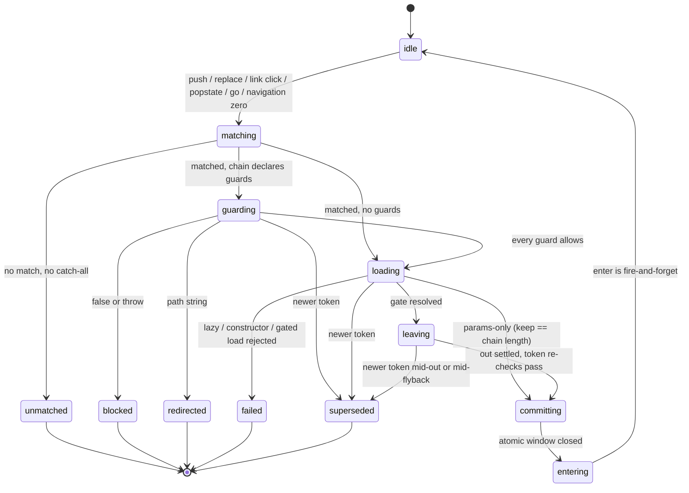

# Navigation state machine

One navigation attempt, request to commit. The machine is the same in every router mode
(path, hash, memory) — a mode owns only three seams (read URL, write URL, link
interception), never the phase order. The step-by-step pipeline is
[[FLOW-NAVIGATION]]; the per-instance machine LOAD and COMMIT drive is
[[STATE-VIEW-LIFECYCLE]]; implementation is [[COMPONENT-ROUTER]].

```mermaid
stateDiagram-v2
  [*] --> idle
  idle --> matching: push / replace / link click / popstate / go / navigation zero
  matching --> unmatched: no match, no catch-all
  matching --> guarding: matched, chain declares guards
  matching --> loading: matched, no guards
  guarding --> loading: every guard allows
  guarding --> blocked: false or throw
  guarding --> redirected: path string
  guarding --> superseded: newer token
  loading --> committing: params-only (keep == chain length)
  loading --> leaving: gate resolved
  loading --> failed: lazy / constructor / gated load rejected
  loading --> superseded: newer token
  leaving --> committing: out settled, token re-checks pass
  leaving --> superseded: newer token mid-out or mid-flyback
  committing --> entering: atomic window closed
  entering --> idle: enter is fire-and-forget
  unmatched --> [*]
  blocked --> [*]
  redirected --> [*]
  failed --> [*]
  superseded --> [*]
```

## The token is a navigation's identity

A monotonic token is claimed after the match, never before — bumping on an unmatched path
would doom a legitimate in-flight navigation, leaving its outgoing view played out over a
router state that still claims it. Every await is followed by a token re-check; stale
results are discarded. Last navigation wins, and the loser cleans up only what it built.

## The commit is atomic

`committing` is one synchronous block: URL and history entry (or memory stack), `document.title`,
the outgoing scroll save, the mounted tree, committed router state, every prepared
reused-ancestor refresh (params, snapshot, model, subscriptions), the scroll landing, then
focus and announcement. Rejected alternatives: committing the URL when loads resolve and
then animating (phantom history entries for superseded navigations, URLs naming views that
never mounted), and rollback (racier than never committing).

## Terminal outcomes are different on purpose

- **unmatched** — nothing happened; no token, so an in-flight navigation is untouched.
- **blocked** — a guard refused; nothing was constructed. A blocked pop repairs the address
  bar (the browser moved it before the guard ran).
- **redirected** — control passed to another navigation with the same verb class; awaiting
  the denied navigation observes the redirect's commit.
- **failed** — a pre-commit failure: fresh instances dropped/destroyed, prepared ancestors
  discarded, stalled leaver restored, error reported, and a popped URL repaired with
  `replaceState` so the address bar matches the DOM. This navigation owns the token, so it
  owns cleanup.
- **superseded** — a newer navigation owns the token. The loser must NOT touch shared state:
  it abandons its fresh instances and leaves the outgoing unit for the winner (tearing it
  down would rip it out from under a mid-flight morph).

## Gotchas

- A pop is asymmetric: the browser already moved the URL, so commit contributes only title
  (and memory index); every non-committing exit on a pop must restore the committed URL.
- `entering` isn't awaited — the machine is effectively idle when the commit window closes,
  which is why a `mounted()` hook's push is parked in one last-wins slot and re-dispatched
  afterwards.
- A skeleton view opts out of the LOAD gate, not the machine: its failure lands after
  commit, so the URL names a page showing its loading state. On prerender takeover at
  navigation zero the exemption is suppressed.
- Post-commit failures (render, `mounted()`) never re-enter this machine; they belong to
  [[STATE-VIEW-LIFECYCLE]] — the commit stands and only the failed position is replaced.
