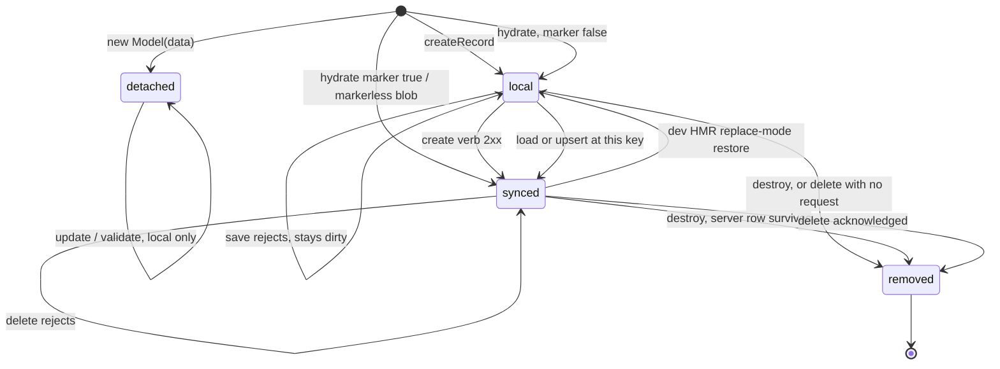

# Store record lifecycle

A record's position is held by three non-enumerable flags — `_store`, `_synced`,
`_deleted` — which are provenance, never data: `toJSON()` can't see them, merge helpers
refuse to copy them from payloads, and persistence carries provenance out of band as a
`__synced` marker. No payload can forge a position. The verbs that move records are
[[FLOW-ADAPTER-SYNC]].

## Positions

- **detached** — `new Model(data)`, never handed to a Store: `update()`/`validate()` work,
  nothing indexes or notifies, no public path adopts it; `save()`/`delete()` reject
  asynchronously.
- **local** — indexed, never round-tripped. `save()` dispatches `create`; `delete()` removes
  locally and sends nothing (after resolving the delete verb, so a partial adapter reports
  the missing verb).
- **synced** — has server provenance (load, `upsert`, hydration, own save). `save()`
  dispatches `update`; `delete()` sends the verb and removes on the ack.
- **removed** — terminal, reached only through `removeRecord`, shared by `destroy()` and a
  confirmed delete so a stale reference never has to tell them apart. A removal also records
  the identity absent for D161.

**Entering**: `createRecord` is indivisible (defaults, pk, validation, insert, notify) — a
failed create leaves no trace. A missing pk auto-generates except under an explicit
`.primary().required()`. Hydration enters at the persisted marker's position (markerless →
`synced`); hydration and server upserts skip validation by design.

## Invariants

- **`_synced` is provenance, not clean/dirty**: "does the server have this row?" It stays
  true after a partly merged save response — clearing it would make the next write POST a
  duplicate.
- **`_deleted` is read before `_store`**: `removeRecord` nulls `_store`, so flag order is
  what distinguishes deleted (resolve idempotently) from never-added (reject).
- **`removeRecord` is the only writer of `_deleted`**, so a queued write tests one flag at
  the front of the chain, with no false positive on a first save.
- **Primary keys are immutable once indexed**, except a first save whose response carries a
  different key: the Store re-keys atomically, assigning the field directly (`update()`
  would throw on a pk change).
- **The index key is not the field**: numeric ids are keyed by string form
  ([[DECISION-D112-STORE-ID-KEY-NORMALIZATION]]); the field keeps the server's type.
- **In-flight is not a position**: writes serialize on one per-record chain and each link
  reads the record when it reaches the front — the position may have moved while it waited.

## Gotchas

- A removed record still accepts `update()`: it validates and lands on an object nothing
  subscribes to, silently.
- `destroy()` on a synced record leaves the server row; nothing reconciles it later.
- Records mutate in place, so identity survives every transition but removal — an upsert
  updates rather than replaces, and references stay valid across loads.
- The dev HMR replace-mode restore is the only `synced → local` path: it writes the
  snapshot's provenance onto the live record so a never-saved record still POSTs after a
  reload.
