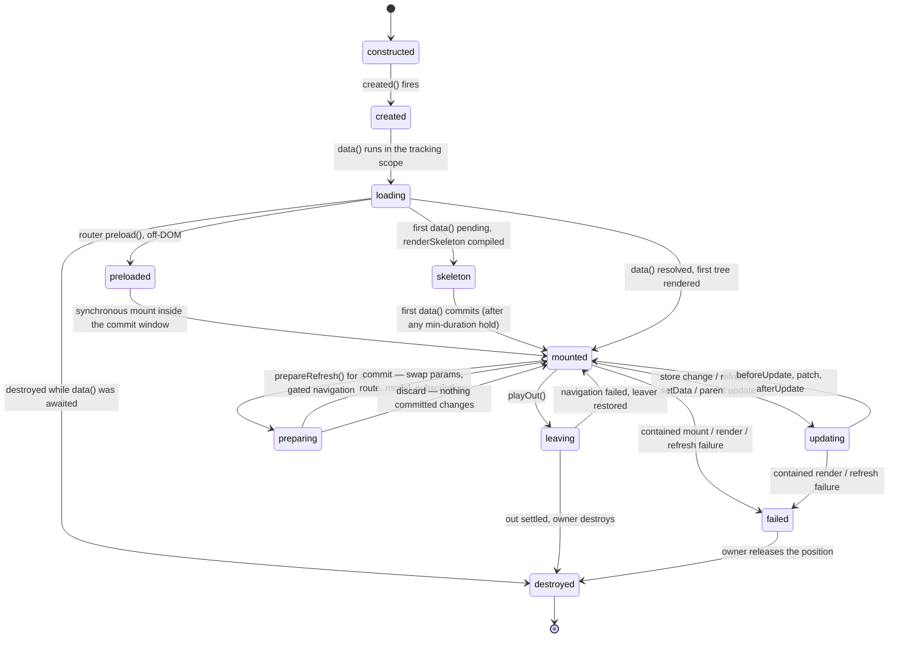

# PuzzleView lifecycle machine

One instance, construction to teardown. Views, layouts and components all run it; only
the owner differs (router for routed views/layouts, a parent's patch for components, the
static kernel for a prerendered root), and ownership decides failure outcomes, not phases.
Implementation: [[COMPONENT-PUZZLE-VIEW]].

## Phase notes

- **updating** is reached two ways that look the same in the DOM: a `data()` re-run
  (model layer replaced, subscriptions re-derived to exactly what the run queried) or
  `setData()` (local layer only, no re-run). Trigger table: [[FLOW-REACTIVITY]].
- **preloaded** makes the navigation commit atomic: `created()` + `data()` run with no
  ViewManager, so the later mount is synchronous (the commit window can't await). A
  parent-mounted component instead reserves its position with a comment anchor.
  `mounted()` waits for a real first render — if a prop update supersedes the initial async
  `data()`, completion (and any enter) defers to the render that commits.
- **preparing** (D146) runs `data()` against the destination while committed params,
  snapshot, model, DOM and subscriptions stay untouched; a store-change refresh in the same
  window still reads committed state. The handle is idempotent and discarded
  unconditionally on the way out (the only cover for a throw escaping the commit block); an
  unreleased hold fences the ancestor's store keys for the session.
- **leaving** is inert: `playOut()` unsubscribes and ignores every later delivery; the
  element stays until the caller removes it. It is reversible once — router recovery
  cancels the retained out effect, refreshes to resubscribe, and fires `viewWillShow()` →
  `viewDidShow()` at zero duration to re-open the show bracket `playOut()` closed (hooks are
  lifecycle, D28). The out stays spent, so a later navigation swaps instantly. A throwing
  restore hook is reported, never raised into the router's window, and a `viewWillShow`
  throw doesn't skip `viewDidShow`.
- **failed** is a position, not a live instance: `destroy()` already ran; a placeholder
  holds the app `errorView` (`{ error, info, retry }`) or an invisible marker. Retry never
  revives this instance — the router's same-location replace or a parent refresh builds a
  new one from `constructed`, and the face is held until something refills the position.
  An error view failing reports once as `phase: 'error-view'` and stops.

## Gotchas

- The `loaded` latch never resets: a skeleton is a first-load affordance; later refreshes
  keep current content until new data commits.
- A `mounted()` throw resolves by owner: a component is destroyed and its position held for
  the next parent patch; a routed view stays committed (the URL already moved atomically).
- `destroy()` is synchronous, instant and idempotent; a throwing `destroyed()` is caught so
  the cascade completes.
- A visible-trigger enter holds the element at `from` and defers the show bracket to the
  reveal; `mounted()` timing is unchanged and every degradation path falls back to plain
  mount.
